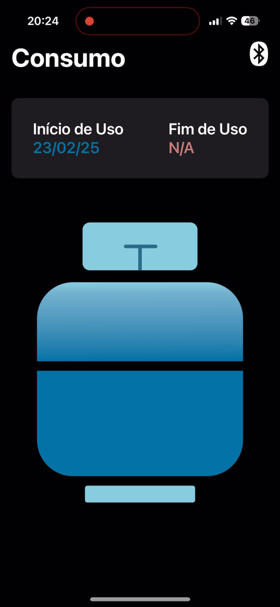
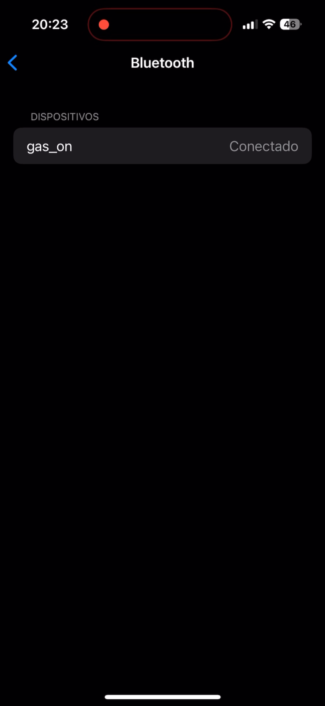

# GasOn - Medidor Inteligente de Consumo de Gás Doméstico

[](https://swift.org/)
[](https://developer.apple.com/ios/)
[](https://developer.apple.com/documentation/swiftui/state-and-data-flow)

Projeto desenvolvido como Trabalho de Conclusão de Curso (TCC) para monitoramento do consumo de gás de botijão, oferecendo uma solução acessível, não invasiva e integrada com IoT.

---

## 📱 Sobre o Projeto

**GasOn** é um sistema completo para monitoramento do consumo de gás doméstico, composto por:
- **Dispositivo IoT**: Sensor de pressão acoplado a uma mangueira siliconada, conectado a um ESP32.
- **Aplicativo iOS**: Interface intuitiva para visualização do nível de gás em tempo real, datas de uso e gerenciamento Bluetooth.

### Destaques:
✅ **Baixo custo** (alternativa aferível a soluções caras do mercado)
✅ **Instalação não invasiva** (sem modificações no botijão)
✅ **Precisão** (leitura indireta via pressão na mangueira)
✅ **IoT Integrada** (transmissão BLE para o app)

---

## ✨ Funcionalidades

### Aplicativo iOS:
- **Nível visual do gás**:
  - 🔵 Azul (80-100%)
  - 🟡 Amarelo (20-80%)
  - 🔴 Vermelho (0-20%)
- **Datas estimadas**:
  - Início de uso
  - Término previsto
- **Conexão BLE**:
  - Listagem de dispositivos pareados
  - Gerenciamento de conexão via CoreBluetooth

### Hardware:
- Leitura de pressão em tempo real
- Processamento de dados com ESP32
- Transmissão sem fio via Bluetooth Low Energy (BLE)

---

## 🛠️ Tecnologias

### iOS:
- **Linguagem**: Swift
- **UI**: SwiftUI
- **Arquitetura**: MVVM
- **Frameworks**:
  - CoreBluetooth (conexão BLE)
  - Combine (fluxo de dados reativo)
  - SwiftData (persistência local)
  - UIKit (componentes customizados)

### Hardware:
- Microcontrolador ESP32
- Sensor de pressão
- Mangueira siliconada customizada

---

## 🚀 Instalação

### Requisitos:
- Xcode 15+
- Dispositivo iOS 17+
- ESP32 configurado com firmware do projeto

### Passos:
1. Clone o repositório:
   ```bash
   git clone https://github.com/kellyleticia/GasOn.git
   ```
2. Instale as dependências via Swift Package Manager.
3. Conecte o ESP32 e inicie o app.
4. Pareie o dispositivo via Bluetooth no app.

---

## 🏗️ Arquitetura

```plaintext
MVVM:
- View (UI): SwiftUI
- ViewModel (Lógica): Combine + SwiftData
- Model (Dados): CoreBluetooth ↔ ESP32
```

---

## 📸 Telas

| Tela Principal | Conexão BLE |
|----------------|-------------|
|  |  |

---
                 
## 📄 Licença

Distribuído sob licença MIT. Veja [LICENSE](LICENSE) para mais detalhes.
```
